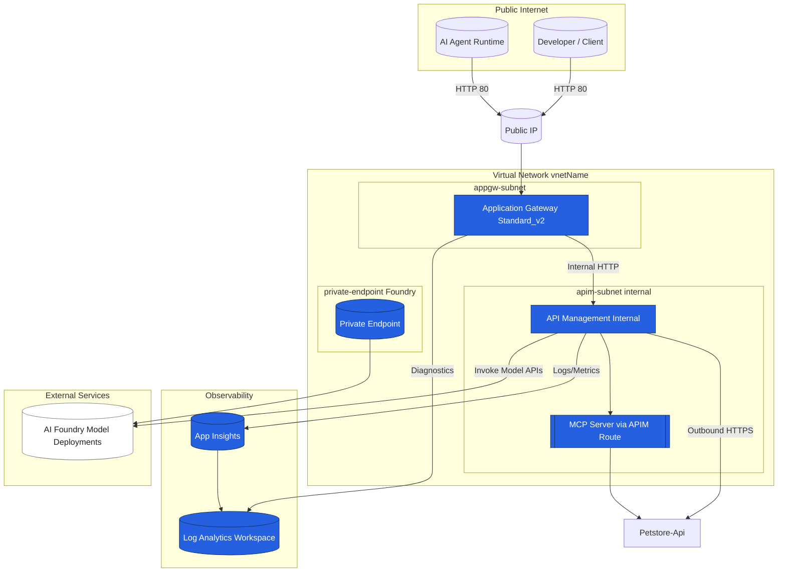

# Bicep

This directory contains bicep templates that are used for various tasks in this project. If you want to use your own parameter files, this repo is setup to copy the `*.bicepparam` files and create your own with the `dev.bicepparam` extension. They will be ignored from check-in. I'm using [Azure Verifed Modules](https://azure.github.io/Azure-Verified-Modules/indexes/bicep/bicep-resource-modules/) where they exist to create these bicep files.

## Deploying with Bicep

Bicep is an Infrastructure as Code (IaC) language developed by Microsoft for deploying Azure resources in a declarative manner. It simplifies the deployment process and enhances readability and maintainability of your infrastructure code. Here is the [official Bicep documentation](https://learn.microsoft.com/en-us/azure/azure-resource-manager/bicep/)

### Prerequisites

Before you begin, ensure you have the following installed:

- Azure CLI: Bicep is integrated directly into the Azure CLI and provides first-class support for deploying Bicep files.
- Bicep CLI: While not strictly necessary due to Azure CLI integration, the Bicep CLI can be useful for compiling, decompiling, and validating Bicep files.

### Steps to Deploy

1. **Login to Azure**

    Start by logging into Azure with the Azure CLI:

    ```bash
    az login
    ```

2. **Set your subscription**

    Make sure you're working with the correct Azure subscription:

    ```bash
    az account set --subscription "<Your-Subscription-ID>"
    ```

3. **Create Resource Group (Optional)

    Make sure the resource group has already been created:

    ```base
    az group create --name <resource-group-name> --location <location>
    ```

4. **Compile Bicep file (Optional)

    If you have Bicep CLI installed, you can manually compile your Bicep file to an ARM template. This step is optional because Azure CLI compiles Bicep files automatically on deployment.

    ```bash
    bicep build <your-file>.bicep
    ```

5. **Deploy the Bicep file**

    Use the Azure CLI to deploy your Bicep file. Replace `<your-resource-group>` with your Azure Resource Group name, and `<your-deployment-name>` with a name for your deployment.  **Note**: since we are using bicep parameter files and they are tied to one bicep file we don't need the --template-file switch.  See [Bicep file with parameters file](https://learn.microsoft.com/en-us/azure/azure-resource-manager/bicep/parameter-files?tabs=Bicep#deploy-bicep-file-with-parameters-file) for more info.

    ```bash
    az deployment group create --resource-group <your-resource-group> --name <your-deployment-name> --parameters <your-file>.bicepparam
    ```

### Deploying examples in this repo

#### **APIM smart load balancing with circuit breaker**

- **Prerequisites**
  - You will need to create 3 Azure OpenAPI endpoints in 3 different regions with 2 deployments (make sure you have the same model version in each region or it will fail). Here is what I have setup:

    | Region | Deployments (version) |
    | ------------- | ----------- |
    |South Central US | gpt-35-turbo (0301), text-embedding-ada-002(2) |
    |East US| gpt-35-turbo (0301), text-embedding-ada-002(2) |
    |West Europe|text-embedding-ada-002 (2)|

- `create-aoai-load-balancing.bicep` is the main template for this. Here we are creating 3 backends (these are OpenAI endpoints) in 3 different Azure regions and load balancing across each of them based on the deployment name. That is 2 backend pools, one for each deployment. This setup is using Round Robin, but there are ways to use weighted and priority in the backend pools. You can find more info in the [load balancing options](https://learn.microsoft.com/en-us/azure/api-management/backends?tabs=bicep#load-balancing-options) doc.

- **Command to deploy via bicep:**

    ```bash
    az deployment group create --resource-group <resource-group-name> --name smart-loadbalancing-deployment --parameters ./iac/bicep/create-aoai-load-balancing.dev.bicepparam
    ```

#### APIM create a backend

- `create-apim-backend.bicep` is the main template to create a new backend in APIM.

#### Create APIMDemo APIM instance

- **Prerequisites:**
  - You will need to fill out the bicep parameter file and in some cases create resources for that. For example, you will need an app registration to get the client id and secret
- `create-apimdemo-resource.bicep` is the main template to create a demo developer instance of API Management.
- **What's Included:**
  - Developer sku of API management
  - Application Insights
  - Identities for the developer portal
    - This will require an app registration with at least `User.Read.All` and `Group.Read.All`. You can read more here to create the [app registrations](https://learn.microsoft.com/en-us/azure/api-management/api-management-howto-aad#manually-enable-microsoft-entra-application-and-identity-provider) to this setup if you have questions.
    - OAuth2.0 servers to handle authentication
    - Diagnostic Loggers

- **Command to deploy via bicep:**

    ```bash
    az deployment group create --resource-group <resource-group-name> --name apimdemo-deployment --parameters ./iac/bicep/create-apimdemo-resource.dev.bicepparam
    ```

#### Create base APIM instance

- `create-base-apim.bicep` is the main template to create a base developer instance of API Management.
- **What's Included:**
  - Developer sku of API management

- **Command to deploy via bicep:**

    ```bash
    az group create --name <resource-group-name> --location <location>
    az deployment group create --resource-group <resource-group-name> --name apim-base-deployment --parameters ./iac/bicep/create-base-apim.dev.bicepparam
    ```

#### Create base APIM instance raw bicep

- `create-base-apim-raw.bicep` is the main template to create a base developer instance of API Management with the new preview features.
- **What's Included:**
  - Developer sku of API management

- **Command to deploy via bicep:**

    ```bash
    az group create --name <resource-group-name> --location <location>
    az deployment group create --resource-group <resource-group-name> --name apim-rawbicep-deployment --parameters ./iac/bicep/create-base-apim-raw.dev.bicepparam
    ```

#### Create base APIM instance with networking options

- `create-base-apim-with-netowrking.bicep` is the main template to create a base premium instance of API Management with networking options (Vnet and subnet). These options are applied as for my demos I want to show what it looks like to do it via the Portal, but it could be easily updated to make it add the networking in the template.
- **What's Included:**
  - Premium sku of API Management
  - VNet
  - Subnet (/27 for APIM)
  - Petstore API added during deployment

- **Command to deploy via bicep:**

    ```bash
    az group create --name <resource-group-name> --location <location>
    az deployment group create --resource-group <resource-group-name> --name apim-base-with-network-deployment --parameters ./iac/bicep/create-base-apim-with-networking.dev.bicepparam
    ```

#### Create AI Package with networking options

- `create-ai-package-with-networking.bicep` is the main template to create an AI package with networking options (Vnet and subnet). These options are applied for my demos so there may be some automation pieces missing for me to be able to demo them in the Portal..
- **What's Included:**
  - Developer sku of API Management
  - VNet
  - 3 Subnets (/24 for APIM, AppGw, and Private Endpoint)
  - Petstore API added during deployment
  - AI Services and Models (if specified in the parameters file)
  - Log Analytics workspace for monitoring

- **Command to deploy via bicep:**

    ```bash
    az group create --name <resource-group-name> --location <location>
    az deployment group create --resource-group <resource-group-name> --name ai-package-with-network-deployment --parameters ./iac/bicep/create-ai-package-with-networking.dev.bicepparam
    ```

#### Create workspace-enabled APIM instance with networking

- `create-ws-enabled-apim-with-networking.bicep` deploys a Premium SKU API Management instance with:
  - Workspaces enabled (example public/private workspaces)
  - Virtual Network and subnets to demonstrate internal vs public routing
  - Intended to showcase how workspace scoping and (optionally) workspace gateways can be layered onto a networked APIM. One important thing that this does NOT do is to create the A record in the private DNS zone for the internal gateway.  You can use the [deploy-apim-and-create-a-record.sh](../../scripts/az-cli/deploy-apim-and-create-a-record.sh) script to run this deployment and it will create the A record for you after the deployment runs. You will then be able to resolve the internal gateway hostname to the internal IP address, you will need to make sure you link you Private DNS zone to your VNet.

- **What's Included:**
  - Premium sku of API Management
  - VNet
    - APIM-Subnet (/24 for internal workspace gateway)
    - AppGw-Subnet (/24 for Application Gateway)
    - PE-Subnet (/24 for Private Endpoint)
  - PetStore api for the global service
  - AI Foundry service and model (if specified in the parameters file)
  - Log Analytics workspace for monitoring
  - Application Gateway v2 in front of APIM

- **Architecture**

  The diagrams below illustrate the private-network deployment of APIM behind an Application Gateway, enabling secure agentic (MCP) calls to external APIs (e.g., Petstore) and model augmentations while preserving internal-only exposure of APIM.



- **Command to deploy via bicep:**

  ```bash
  az group create --name <resource-group-name> --location <location>
  az deployment group create --resource-group <resource-group-name> --name apim-ws-network-deployment --parameters ./iac/bicep/create-ws-enabled-apim-with-networking.dev.bicepparam
  ```

### Cleanup

Make sure you clean up when you are done using these resources. The simplest way to do that is to just delete the resource group:

```bash
az group delete --name <resource-group-name>
```

This will delete everything for you, but the API Management instance will be soft-deleted.  Check out this feature [here](https://learn.microsoft.com/en-us/azure/api-management/soft-delete).  To permanently delete (purge) the API Management instance run the following command:

```bash
az apim deletedservice purge --service-name <apim-service-name> --location <location>
```
